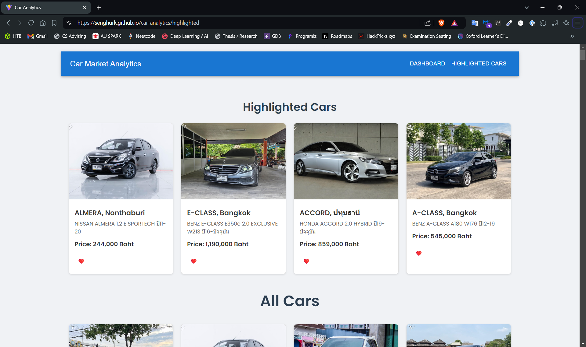

# Car Analytics Dashboard

## Description

This is the project-01 for WAD 1/2024. The Car Analytics Dashboard is a web-based application designed to provide insightful analytics and visualization of car market data. The web-app is only for the market owner (not buyers or sellers). 

## Screenshots

### Dashboard Overview
- Dashboard showing car analytics


### Brand Distribution Chart
- Pie Chart and Bar Chart showing distribution of car brands


### Highlighted Cars
- Highlight and track specific cars of interest


## Key Features

- **Brand and Model Overview**: A detailed breakdown of car brands and their respective models, showing the number of cars and their total market value.
- **Expandable Data Table**: An interactive table that allows users to look into specific brands and view detailed information about each model.
- **Interactive Data Visualization**: Using Chart.js to create dynamic pie charts and bar graphs, showing a visual representation of car distribution by brands and models.
- **Highlighted Cars Section**: A feature that enables users to mark and track specific cars of interest, with data persisting across sessions.

## Technology Used

- React.js
- Vite
- Chart.js
- Material-UI
- React Router
- Use Local Storage for persistence
- Data is from the provided JSON file (No Backend)


## Getting Started

### Prerequisites

- Node.js (v14 or later recommended)
- pnpm

### Installation

1. Clone the repository:
   ```
   git clone https://github.com/senghurk/car-analytics.git
   ```

2. Navigate to the project directory:
   ```
   cd car-analytics
   ```

3. Install dependencies:
   ```
   pnpm install
   ```

4. Start the development server:
   ```
   pnpm run dev
   ```

5. Open your browser and visit `http://localhost:xxxx` to view the application.

## Deployment

This project is configured for deployment on GitHub Pages. To deploy:

1. Ensure your `vite.config.js` and `package.json` are correctly configured with your repository details.

2. Run the deploy script:
   ```
   pnpm run deploy
   ```

This will build the project and push it to the `gh-pages` branch of your repository.

## Contributors

- Sai Oan Hseng Hurk - 6440041
- Aung Khant         - 6511724 
- Kaung Myat Min     - 6511149 
 

## License

[MIT License](LICENSE)